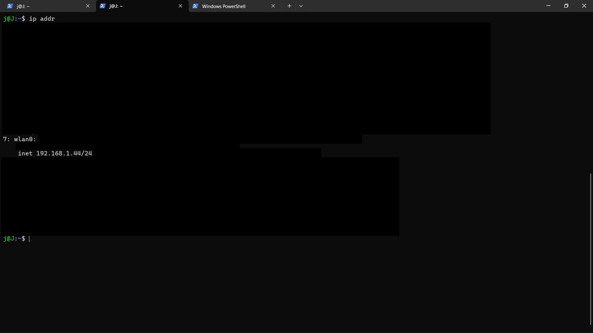
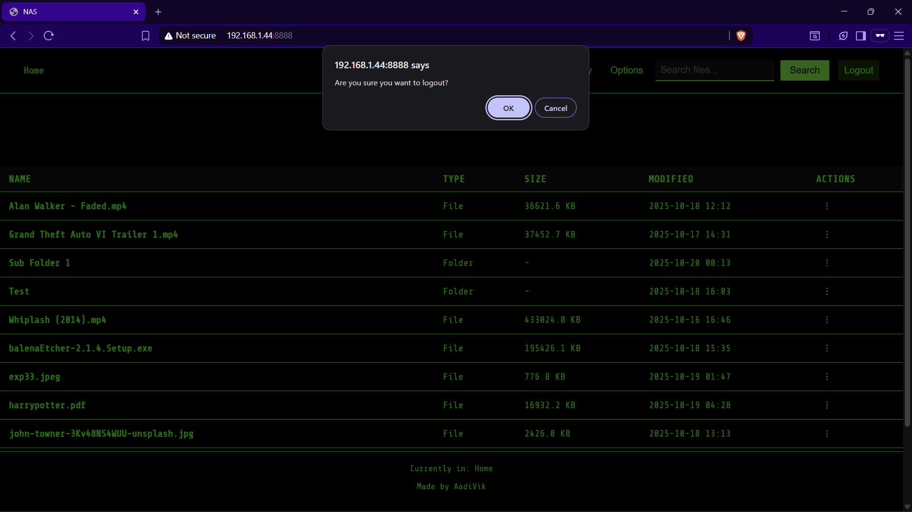

# NAS Server on Ubuntu

Network Attached Storage on a Python server running in Ubuntu

## Functionalities

- Launcher GUI
- File access
- Search in current directory
- Subfolder access with function to go back to previous directory
- Create new folder, upload file and folder in current directory
- Progress bar on upload file
- Download and delete file
- Download folder as zip and delete
- Rename file and folder
- Delete file and folder
- View file details
- Preview Files with navigation and thumbnail preview for images and videos
- Gallery functionality for current folder
- Range request for video display to enable seek forward or jump to a timeline
- Logout feature that kills server process and redirects to login page

## Steps

- Initial setup on Ubuntu
  - Create a directory /nas/storage/files on Ubuntu
  - This will serve as root directory for the NAS
  - Give permission to current user to read and write from it with command sudo chmod 0755 /nas/storage/files
  - Transfer app.py, server.py, template.html, style.css and main.js to the above directory

- To access server on Windows through login page
  - Run python3 /nas/storage/files/app.py on Ubuntu
  - Open http://<ubuntu_ip>:5000 in browser to open Launcher
  - Enter credentials and wait for http://<ubuntu_ip>:8888 to open
  - Now the app is running on server and can be accessed from any device on same Wi-Fi at http://<ubuntu_ip>:8888
  - To logout and kill process, click on Logout button. It will redirect to login page and kill process on 8888
  - app.py should be running in a terminal window in Ubuntu always
  - To get Ubuntu IP, in terminal type ip addr and search for wlan0. There will be an inet with IP in the form 192.168.x.x

- To access server without login
  - Run python3 /nas/storage/files/server.py
  - Open http://<ubuntu_ip>:8888 in browser to access the server without entering credentials
  - server.py should be running in a terminal window in Ubuntu always
  - To kill process in Ubuntu
    - sudo netstat | -tulnp grep 8888 to get process ID
    - sudo kill -9 <process_id>
  - To get Ubuntu IP, in terminal type ip addr and search for wlan0. There will be an inet with IP in the form 192.168.x.x

## NAS Launcher

## Root Directory

## Subfolder with Parent Traversal

## More options in Current Directory

## Upload Progress Bar

## More options on a File

## File Details

## More options on a Folder

## Delete Functionality

## Gallery Functionality in current directory

## Preview Functionality (Video) with Navigation and Preview

## Preview Functionality (Image) with Navigation and Preview. Can be opened in new tab by clicking in preview

## Preview Functionality (Text)

## Preview Functionality (PDF)

## Logout functionality

## Android file access

## Android file viewing

