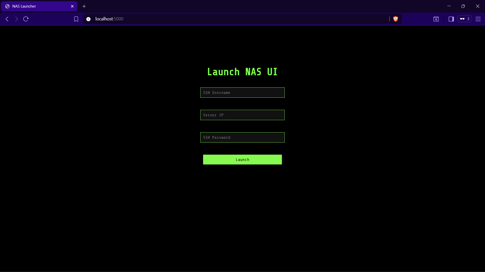
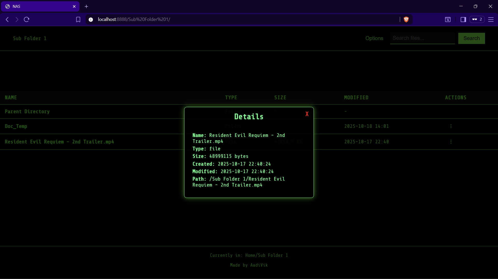
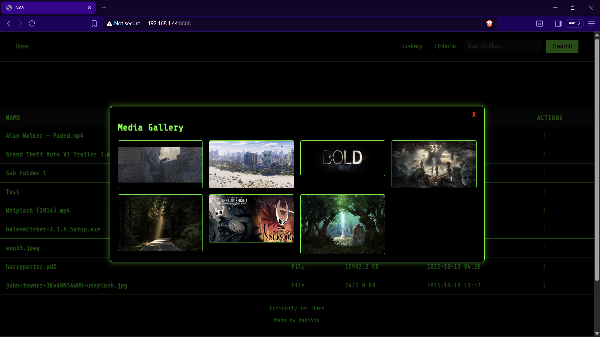
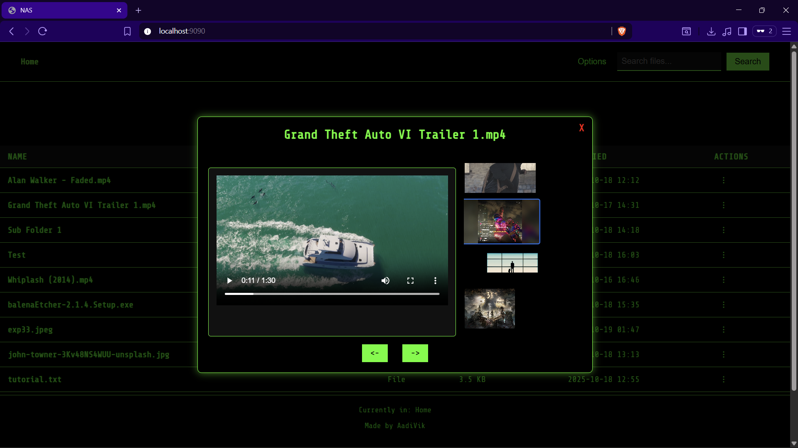
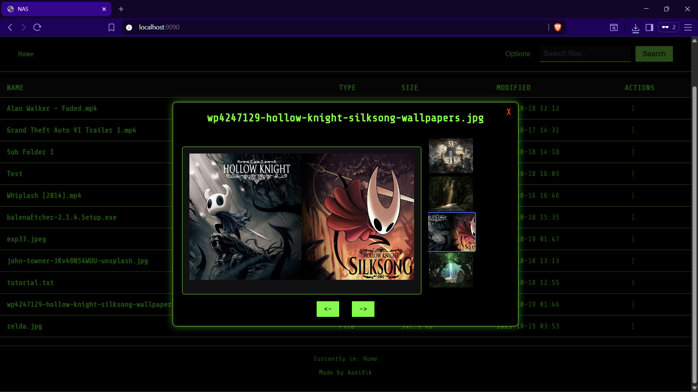
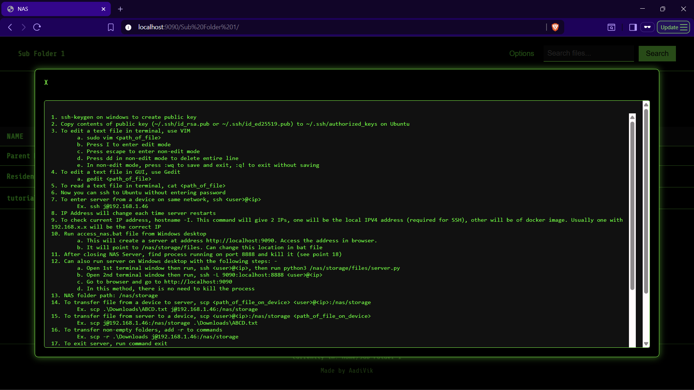
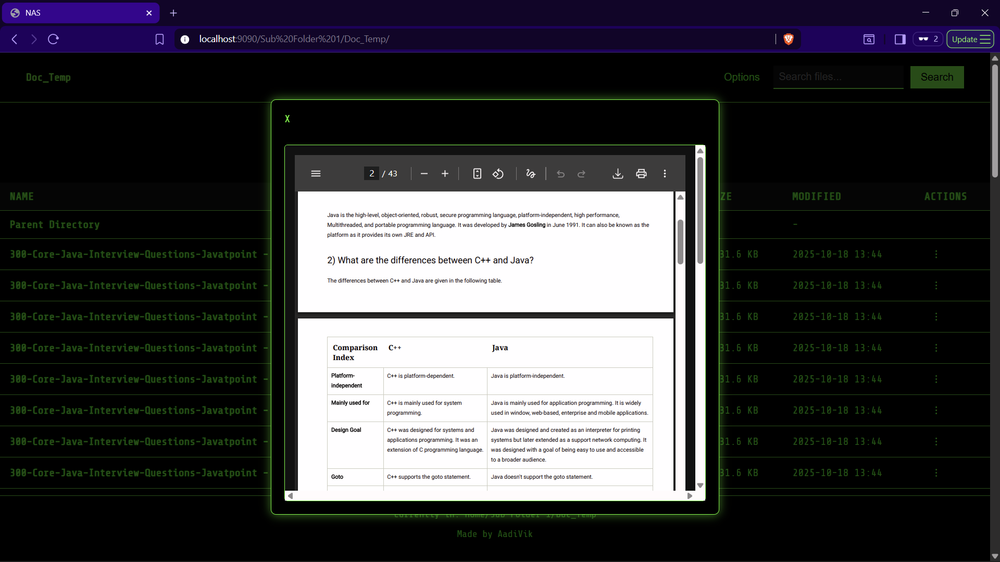

# NAS Server on Ubuntu

Network Attached Storage on a Python server running in Ubuntu

## Functionalities

- Launcher GUI
- File access
- Search in current directory
- Subfolder access with function to go back to previous directory
- Create new folder, upload file and folder in current directory
- Progress bar on upload file
- Download and delete file
- Download folder as zip and delete
- Delete file and folder
- View file details
- Preview Files with navigation and thumbnail preview for images and videos
- Gallery functionality for current folder
- Range request for video display to enable seek forward or jump to a timeline

## Steps

### Only initial setup and first access method is needed

- Initial setup on Ubuntu
  - Create a directory /nas/storage/files on Ubuntu
  - This will serve as root directory for the NAS
  - Give permission to current user to read and write from it with command sudo chmod 0755 /nas/storage/files
  - Transfer server.py, template.html, style.css and main.js to the above directory

- To access server on Windows through GUI (easy method)
  - Run python3 app.py on Ubuntu
  - Open http://<ubuntu_ip>:5000 in browser to open Launcher
  - Enter credentials and wait for http://<ubuntu_ip>:8888 to open
  - Now the app is running on server and can be accessed from any device on same Wi-Fi at http://<ubuntu_ip>:8888
  - python3 app.py can be quit

### Rest of the methods of access are not needed

- To access server on any device on same Wi-Fi after access is established on above system
  - Get IPV4 of above system. If it is Windows, type ipconfig in terminal
  - Let it be device_ip
  - In browser, http://<device_ip>:8888

- To access server on Windows through terminal
  - Open 1st terminal window and run ssh <ubuntu_user>@<ubuntu_ip>, then run python3 /nas/storage/files/server.py
  - Open 2nd terminal window and run ssh -L 8888:localhost:8888 <ubuntu_user>@<ubuntu_ip> to create a tunnel to the running server
  - Or just run access_nas.bat file and skip above 2 steps
  - Go to browser and enter http://localhost:8888
  - After closing server that was started using the bat file, it is needed to kill the python process
  - Find PID of the process by running sudo netstat -tulnp | grep :8888
  - sudo kill -9 pid
  - Process is automatically killed if server is started manually by running server.py

- To access server on Android through terminal
  - Install Termux from Play Store
  - Run command, pkg install socat
  - Open 1st terminal window and run ssh <ubuntu_user>@<ubuntu_ip>, then run python3 /nas/storage/files/server.py
  - Open 2nd terminal window and run ssh -L 8888:localhost:8888 <ubuntu_user>@<ubuntu_ip> to create a tunnel to the running server
  - Open 3rd terminal window and run socat TCP-LISTEN:8888,bind=<android_ip>,fork TCP:127.0.0.1:8888
  - Go to browser and enter http://<android_ip>:8888
  - To find Android IP, go to Settings > Connections > Wi-Fi Name > Scroll down to find IP Address
  - Type exit to close open terminals

## NAS Launcher

## Root Directory

## Subfolder with Parent Traversal

## More options in Current Directory

## Upload Progress Bar

## More options on a File

## File Details

## More options on a Folder

## Delete Functionality

## Gallery Functionality in current directory

## Preview Functionality (Video) with Navigation and Preview

## Preview Functionality (Image) with Navigation and Preview. Can be opened in new tab by clicking in preview

## Preview Functionality (Text)

## Preview Functionality (PDF)

## Android file access

## Android file viewing

