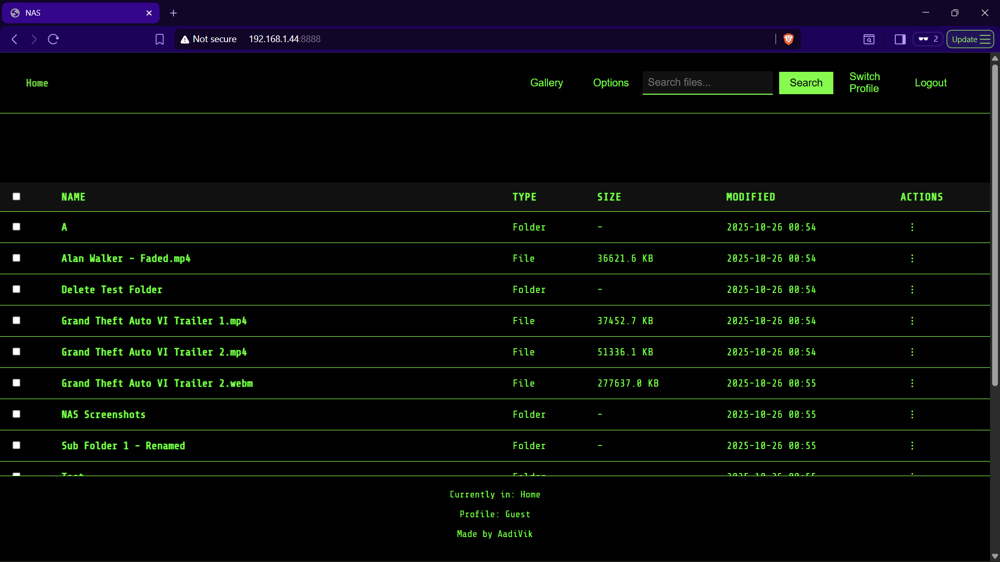
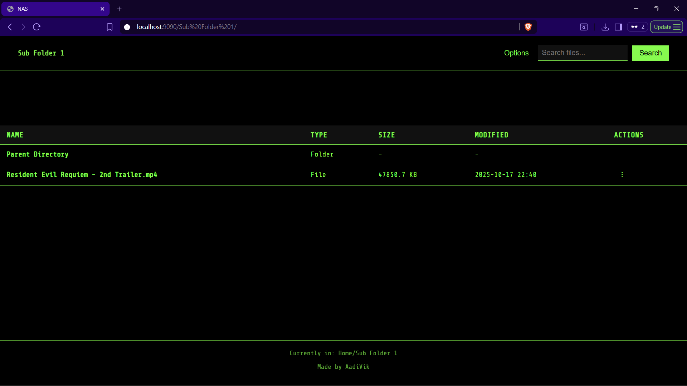
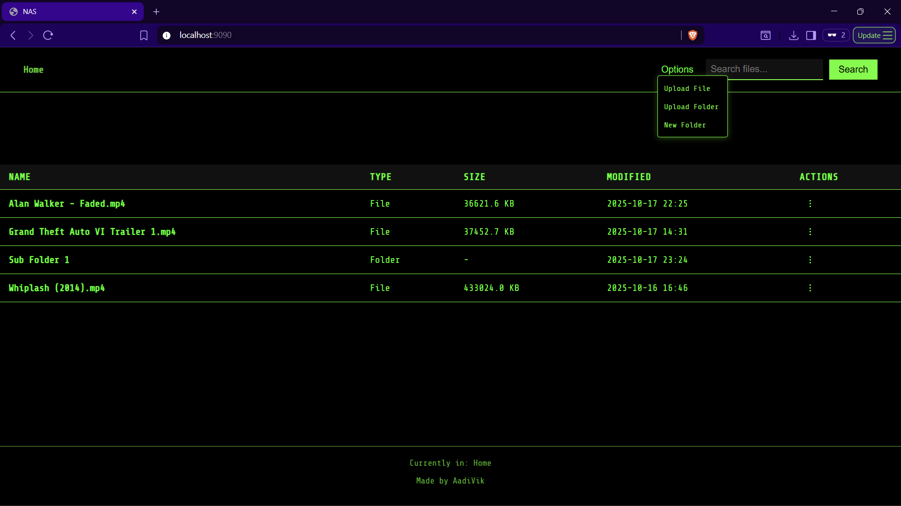
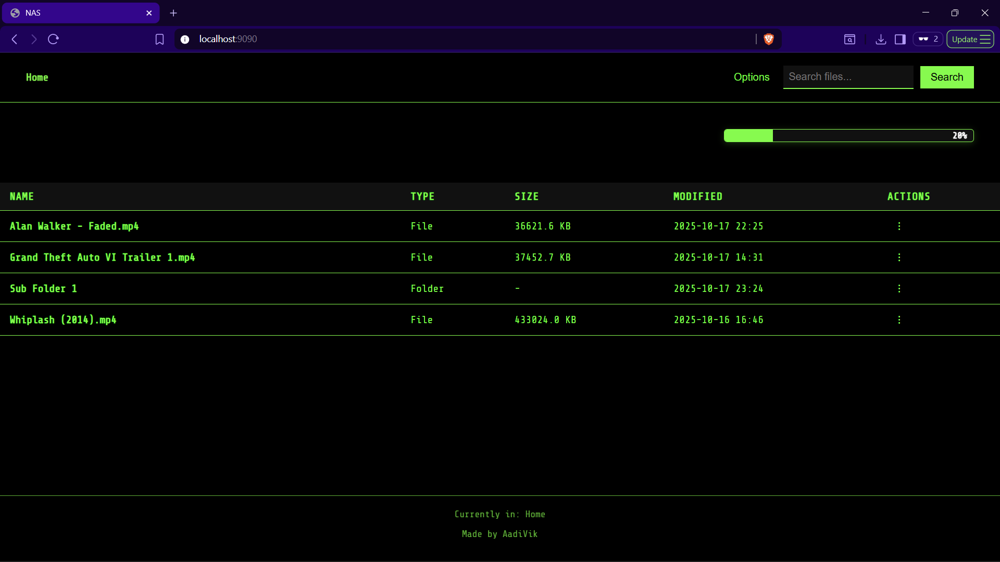
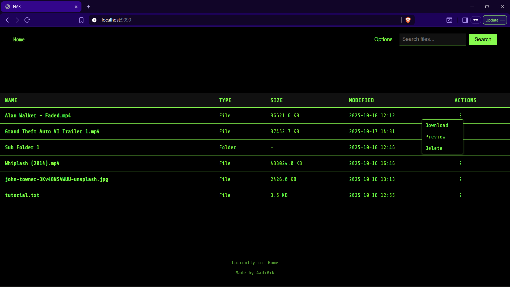
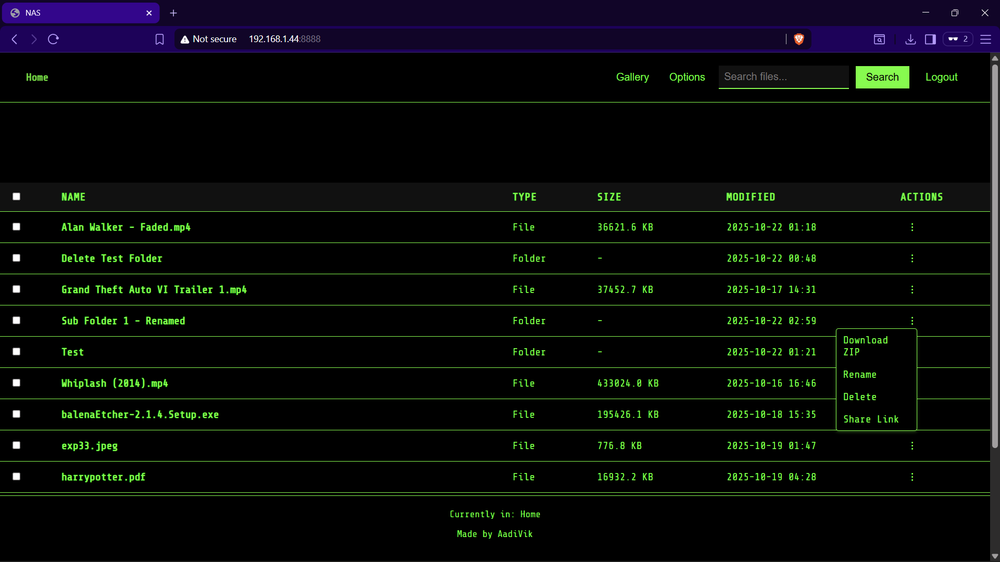
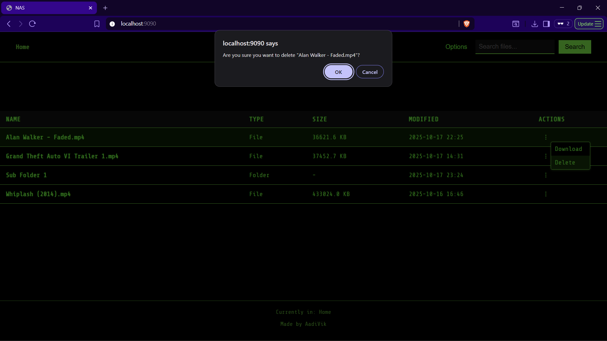
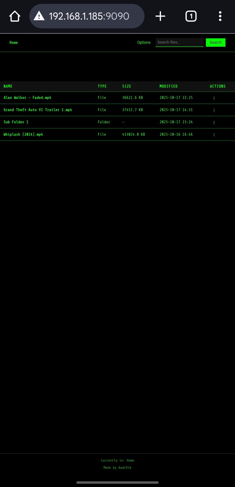
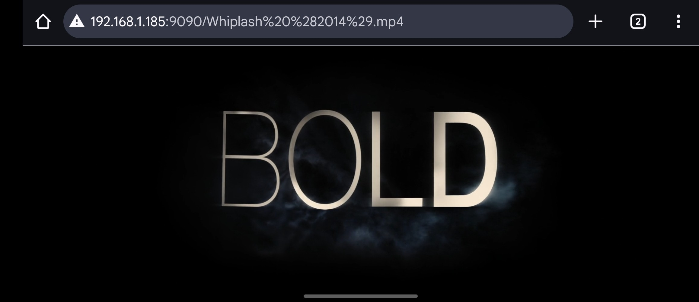

# NAS Server on Ubuntu

Network Attached Storage on a Python server running in Ubuntu

## Functionalities

- File access
- Search in current directory
- Subfolder access with function to go back to previous directory
- Create new folder, upload file and folder in current directory
- Progress bar on upload file
- Download and delete file
- Download folder as zip and delete
- Delete file and folder
- Preview Files

## Steps

- Initial setup on Ubuntu
  - Create a directory /nas/storage/files on Ubuntu
  - This will serve as root directory for the NAS
  - Give permission to current user to read and write from it with command sudo chmod 0755 /nas/storage/files
  - Transfer server.py, template.html, style.css and main.js to the above directory

- To access server on Windows
  - Open 1st terminal window and run ssh <ubuntu_user>@<ubuntu_ip>, then run python3 /nas/storage/files/server.py
  - Open 2nd terminal window and run ssh -L 9090:localhost:8888 <ubuntu_user>@<ubuntu_ip> to create a tunnel to the running server
  - Or just run access_nas.bat file and skip above 2 steps
  - Go to browser and enter http://localhost:9090
  - After closing server that was started using the bat file, it is needed to kill the python process
  - Find PID of the process by running sudo netstat -tulnp | grep :8888
  - sudo kill -9 pid
  - Process is automatically killed if server is started manually by running server.py

- To access server on Android
  - Install Termux from Play Store
  - Run command, pkg install socat
  - Open 1st terminal window and run ssh <ubuntu_user>@<ubuntu_ip>, then run python3 /nas/storage/files/server.py
  - Open 2nd terminal window and run ssh -L 9090:localhost:8888 <ubuntu_user>@<ubuntu_ip> to create a tunnel to the running server
  - Open 3rd terminal window and run socat TCP-LISTEN:9090,bind=<android_ip>,fork TCP:127.0.0.1:9090
  - Go to browser and enter http://<android_ip>:9090
  - To find Android IP, go to Settings > Connections > Wi-Fi Name > Scroll down to find IP Address
  - Type exit to close open terminals

## Root Directory

## Subfolder with Parent Traversal

## More options in Current Directory

## Upload Progress Bar

## More options on a File

## More options on a Folder

## Delete Functionality

## Preview Functionality

## Android file access

## Android file viewing

